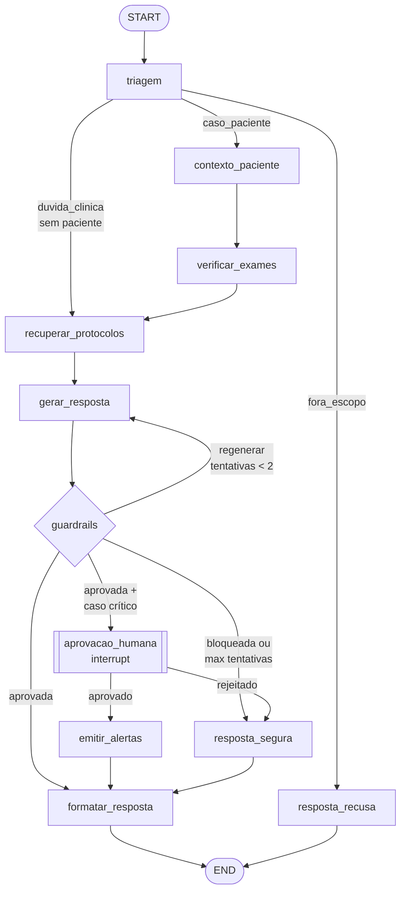

# Design detalhado do grafo LangGraph

Especificação do fluxo de decisão do assistente médico, nó a nó.

## 1. Diagrama geral



Três decisões estruturais sustentam esse desenho:

1. **Guardrails como nó, não só como prompt.** Instrução no system prompt reduz, mas não garante. Um nó validador independente inspeciona a saída e tem poder de veto — e o veredito fica registrado no estado, o que alimenta a auditoria (requisito 3 do enunciado).
2. **Loop de regeneração limitado.** Resposta reprovada volta para `gerar_resposta` com as violações injetadas no prompt ("sua resposta anterior prescreveu dosagem; reformule indicando o protocolo e a necessidade de validação médica"). Máximo de 2 tentativas; depois cai no fallback `resposta_segura` — o grafo nunca entra em loop infinito.
3. **Interrupt só onde há efeito colateral.** Consultar dados é seguro; *registrar* uma sugestão de tratamento ou emitir alerta para a equipe é ação com consequência — por isso o `interrupt()` fica exatamente antes desses efeitos.

## 2. Estado do grafo

```python
from typing import Annotated, Literal, TypedDict
from langgraph.graph.message import add_messages

class DocRecuperado(TypedDict):
    doc_id: str          # ex.: "PROT-001"
    titulo: str
    secao: str
    conteudo: str
    score: float

class AssistantState(TypedDict):
    # --- entrada ---
    messages: Annotated[list, add_messages]  # histórico multi-turno
    pergunta: str
    paciente_id: str | None

    # --- triagem ---
    intencao: Literal["duvida_clinica", "caso_paciente", "fora_escopo"]

    # --- contexto (nós 2 e 3) ---
    paciente: dict | None        # demografia, comorbidades, alergias, medicações
    exames_pendentes: list[dict]
    exames_criticos: list[dict]  # valores fora de faixa crítica

    # --- RAG (nó 4) ---
    docs: list[DocRecuperado]
    sem_fonte: bool              # True se nenhum doc passou do score mínimo

    # --- geração (nó 5) ---
    resposta_bruta: str
    tentativas: int              # contador do loop de regeneração

    # --- guardrails (nó 6) ---
    veredito: Literal["aprovada", "regenerar", "bloqueada"]
    violacoes: list[str]         # ex.: ["prescricao_direta", "dosagem_sem_validacao"]

    # --- ações e saída ---
    requer_aprovacao: bool       # dispara o interrupt
    alertas_emitidos: list[dict]
    resposta_final: str
    fontes: list[str]            # ["PROT-001 §2 — Manejo de sepse", ...]
    erro: str | None             # falha técnica em qualquer nó → resposta_segura
```

Notas:

- `messages` com o reducer `add_messages` dá memória multi-turno de graça — o médico pode fazer pergunta de acompanhamento sem repetir o contexto.
- `erro` é preenchido por um wrapper comum a todos os nós (ver §5); qualquer exceção técnica roteia para `resposta_segura` em vez de estourar para o usuário.
- Campos como `violacoes` e `veredito` existem *no estado* (e não só em variáveis locais) de propósito: o checkpointer persiste o estado a cada super-step, então o histórico de decisões vira trilha de auditoria consultável.

## 3. Especificação nó a nó

### 3.1 `triagem`
- **Faz:** classifica a entrada em `duvida_clinica` (pergunta geral, ex.: "qual o protocolo de dor torácica?"), `caso_paciente` (menciona/seleciona um paciente) ou `fora_escopo` (qualquer coisa não-clínica, pedidos de prescrição direta pelo paciente, etc.).
- **Como:** chamada rápida ao LLM com saída estruturada (`with_structured_output` num `Literal`), com regras determinísticas antes (se `paciente_id` veio da UI → `caso_paciente` direto, sem gastar tokens).
- **Guardrail de entrada:** `fora_escopo` corta o fluxo na porta — o assistente nem tenta responder o que não deve.

### 3.2 `contexto_paciente`
- **Faz:** monta o resumo estruturado do paciente via `db/queries.py`: demografia, comorbidades, **alergias**, medicações em uso, últimas evoluções.
- **Contrato:** paciente inexistente → `erro = "paciente_nao_encontrado"` (roteia para `resposta_segura`, que explica o problema). Nunca inventa contexto.
- **Alergias são first-class:** entram destacadas no prompt de geração, pois são o caso clássico de sugestão perigosa.

### 3.3 `verificar_exames`
- **Faz:** duas consultas — exames com status `pendente` e resultados recentes com valores em faixa crítica (ex.: potássio > 6.0).
- **Saída:** preenche `exames_pendentes` (vira aviso na resposta: "há hemograma pendente que pode alterar a conduta") e `exames_criticos` (seta `requer_aprovacao`/alerta).
- É aqui que nasce o requisito do enunciado "verificar exames pendentes … e emitir alertas".

### 3.4 `recuperar_protocolos`
- **Faz:** busca no ChromaDB com a pergunta reescrita (pergunta + termos do contexto do paciente, ex.: adiciona "insuficiência renal" se o paciente tem), top-k=4, score mínimo 0.35.
- **`sem_fonte = True`** quando nada passa do corte. A geração continua, mas a resposta final é obrigatoriamente marcada como "conhecimento geral do modelo — validar com literatura" (explainability honesta, em vez de citação forjada).

### 3.5 `gerar_resposta`
- **Faz:** chama a LLM fine-tuned com prompt em camadas:
  1. system prompt de segurança (fixo, o mesmo usado no fine-tuning);
  2. contexto do paciente + alergias + exames;
  3. chunks recuperados, cada um prefixado com seu `doc_id`/seção — o modelo é instruído a citar inline `[PROT-001 §2]`;
  4. se `tentativas > 0`: feedback das `violacoes` da rodada anterior.
- **Incrementa `tentativas`.**

### 3.6 `guardrails` (nó condicional)
Validação em duas camadas, da barata para a cara:

| Camada | Mecanismo | Exemplos de captura |
|---|---|---|
| 1. Determinística | regex/listas sobre a resposta | padrões de posologia ("tomar X mg de Y a cada Zh") sem menção a validação; diagnóstico definitivo ("o paciente tem…" vs. "o quadro é compatível com…"); menção a medicamento ao qual o paciente é **alérgico** |
| 2. LLM-verificador | chamada com rubrica de segurança, saída estruturada | tom prescritivo sutil, extrapolação além dos docs citados, citação de doc que não está em `docs` (anti-alucinação de fonte) |

- **Roteamento:** `aprovada` → segue; `regenerar` (violação corrigível e `tentativas < 2`) → volta ao 3.5; `bloqueada` (violação grave, ex.: alergia) ou tentativas esgotadas → `resposta_segura`.
- Cada veredito é logado com as violações — este log é a peça central da demo de auditoria no vídeo.

### 3.7 `aprovacao_humana` (interrupt)
- **Quando:** `requer_aprovacao = True` — a resposta contém sugestão de tratamento/procedimento, ou há `exames_criticos`.
- **Como:** `interrupt()` do LangGraph pausa o grafo e devolve à UI um payload com a resposta proposta + fontes + motivo. O médico aprova/rejeita na UI; o grafo retoma com `Command(resume={"aprovado": bool, "observacao": str})`.
- **Requer checkpointer** (ver §4) — o estado pausado fica persistido, a aprovação pode vir minutos depois, em outra request.
- Rejeição → `resposta_segura` com a observação do médico registrada no log.

### 3.8 `emitir_alertas`
- **Faz:** grava na tabela `alertas` (paciente, tipo, severidade, resposta associada, quem aprovou) — só executa **depois** da aprovação humana quando ela foi exigida.
- Idempotente por `(paciente_id, tipo, dia)` para não duplicar alerta se o grafo for retomado.

### 3.9 `formatar_resposta` / `resposta_segura` / `resposta_recusa`
- **`formatar_resposta`:** resposta + bloco "📚 Fontes" (deduplicadas de `docs` efetivamente citados) + avisos (exames pendentes) + disclaimer fixo: *"Sugestão de apoio à decisão. Requer validação por médico responsável."*
- **`resposta_segura`:** fallback sem LLM (template) — explica que não foi possível responder com segurança e por quê (`violacoes` ou `erro`), sugerindo caminho manual. Nunca deixa o usuário sem saída.
- **`resposta_recusa`:** mensagem educada de escopo para `fora_escopo`.

## 4. Montagem, checkpointing e retomada

```python
from langgraph.graph import StateGraph, START, END
from langgraph.checkpoint.sqlite import SqliteSaver

def construir_grafo():
    g = StateGraph(AssistantState)

    for nome, fn in NOS.items():          # dict nome -> função decorada com @auditado
        g.add_node(nome, fn)

    g.add_edge(START, "triagem")
    g.add_conditional_edges("triagem", rota_triagem, {
        "fora_escopo": "resposta_recusa",
        "duvida_clinica": "recuperar_protocolos",
        "caso_paciente": "contexto_paciente",
    })
    g.add_edge("contexto_paciente", "verificar_exames")
    g.add_edge("verificar_exames", "recuperar_protocolos")
    g.add_edge("recuperar_protocolos", "gerar_resposta")
    g.add_edge("gerar_resposta", "guardrails")
    g.add_conditional_edges("guardrails", rota_guardrails, {
        "regenerar": "gerar_resposta",
        "bloqueada": "resposta_segura",
        "aprovar": "aprovacao_humana",
        "aprovada": "formatar_resposta",
    })
    g.add_conditional_edges("aprovacao_humana", rota_aprovacao, {
        "aprovado": "emitir_alertas",
        "rejeitado": "resposta_segura",
    })
    g.add_edge("emitir_alertas", "formatar_resposta")
    g.add_edge("resposta_segura", "formatar_resposta")
    g.add_edge("formatar_resposta", END)
    g.add_edge("resposta_recusa", END)

    checkpointer = SqliteSaver.from_conn_string("data/checkpoints.db")
    return g.compile(checkpointer=checkpointer)

# invocação: thread_id = id da conversa (sessão do médico + paciente)
grafo.invoke(entrada, config={"configurable": {"thread_id": sessao_id}})
```

- **`SqliteSaver`** (não `MemorySaver`): sobrevive a restart, viabiliza o interrupt assíncrono e — bônus — o histórico de checkpoints é mais uma camada de auditoria (`grafo.get_state_history(config)`).
- **`thread_id`** por sessão médico+paciente dá memória de conversa isolada por caso.
- O diagrama do relatório sai direto do código: `grafo.get_graph().draw_mermaid()` — nunca desatualiza.

## 5. Logging transversal

Um decorator único envolve todos os nós — nenhum nó implementa logging próprio:

```python
def auditado(fn):
    @wraps(fn)
    def wrapper(state):
        log = structlog.get_logger().bind(no=fn.__name__, thread=state.get("thread_id"))
        t0 = time.perf_counter()
        try:
            delta = fn(state)
            log.info("no_concluido", delta_keys=list(delta), ms=int((time.perf_counter()-t0)*1000))
            return delta
        except Exception as e:
            log.error("no_falhou", erro=str(e))
            return {"erro": f"{fn.__name__}: {e}"}
    return wrapper
```

Campos sensíveis (nome do paciente) são mascarados pelo processor do structlog antes da escrita — o log de auditoria também respeita a anonimização.

## 6. Cenários de teste do grafo (para `tests/test_graph.py`)

| # | Cenário | Caminho esperado |
|---|---|---|
| 1 | Pergunta geral sobre protocolo | triagem → RAG → gerar → guardrails ✓ → formatar (com fontes) |
| 2 | Caso de paciente com exame pendente | inclui `verificar_exames`; resposta contém aviso do exame |
| 3 | Sugestão de tratamento | `requer_aprovacao` → interrupt → resume aprovado → alerta gravado |
| 4 | Resposta com posologia direta (mock da LLM) | guardrails → regenerar → 2ª tentativa aprovada |
| 5 | Medicamento com alergia do paciente (mock) | guardrails → **bloqueada** → resposta_segura |
| 6 | Pergunta fora de escopo ("quanto é 2+2?") | triagem → recusa |
| 7 | RAG sem resultados | `sem_fonte=True`, resposta marcada "sem fonte interna" |
| 8 | Paciente inexistente | `erro` → resposta_segura |
| 9 | LLM indisponível | wrapper captura → resposta_segura, log de erro |

Os testes usam uma LLM fake (respostas roteirizadas por cenário) — o grafo inteiro é testável sem GPU e roda em CI.
